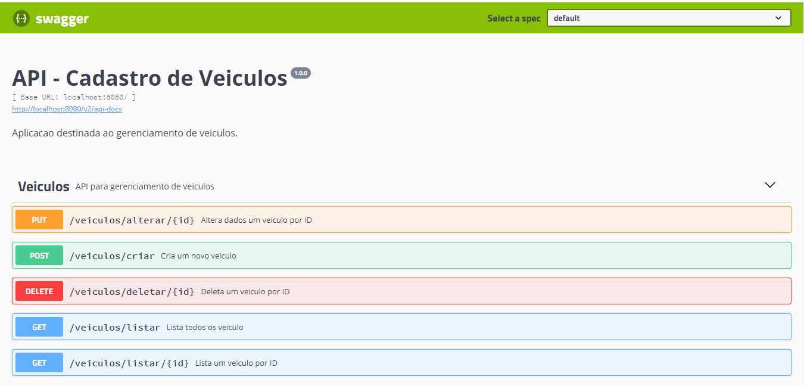
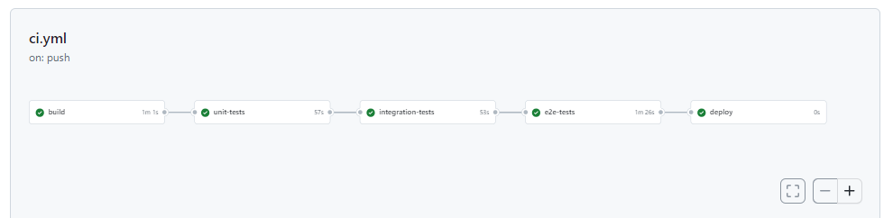

## API de Gerenciamento de Veículos

Este é um projeto de API para gerenciamento de veículos. Ele permite criar, listar, atualizar e deletar informações sobre veículos.

### Tecnologias utilizadas:

- Java 17
- Spring Boot
- Gradle
- RestAssured

### Serviços:

A API oferece os seguintes endpoints:

- POST /veiculos/criar: Cria um novo veículo.
- GET /veiculos/listar/{id}: Retorna as informações de um veículo específico por ID.
- GET /veiculos/listar: Retorna a lista de todos os veículos.
- PUT /veiculos/alterar/{id}: Atualiza os dados de um veículo por ID.
- DELETE /veiculos/deletar/{id}: Deleta um veículo por ID.

### Documentação da API:

- A API está documentada usando a especificação Swagger. Para acessar a documentação da API, acesse http://localhost:8080/swagger-ui.html após iniciar o projeto.

## Jobs:

### Execute o projeto usando o Gradle:
- ./gradlew bootRun

### Testes Unitários:
- ./gradlew test --tests "api.veiculos.units.

### Testes de Integração :
- ./gradlew test --tests "api.veiculos.integration.*"
